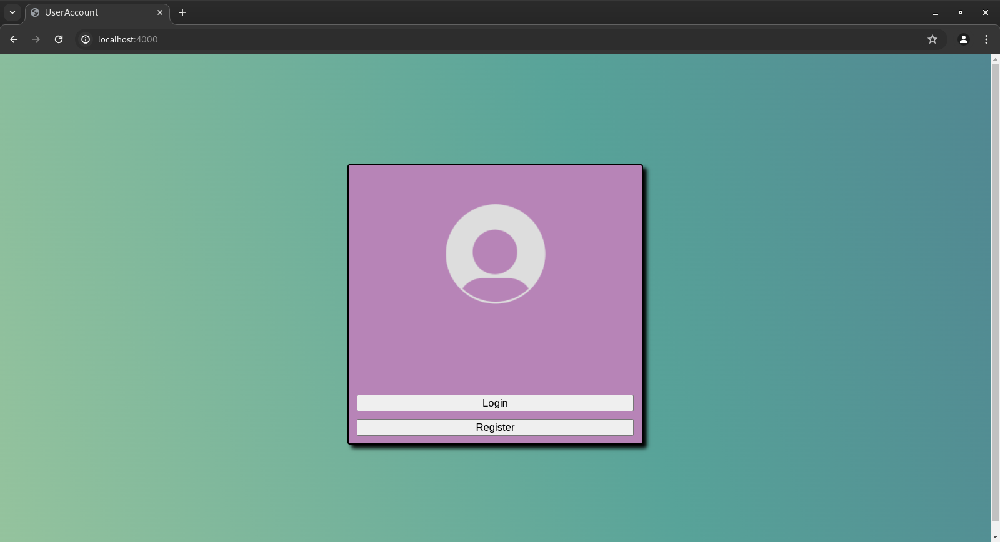
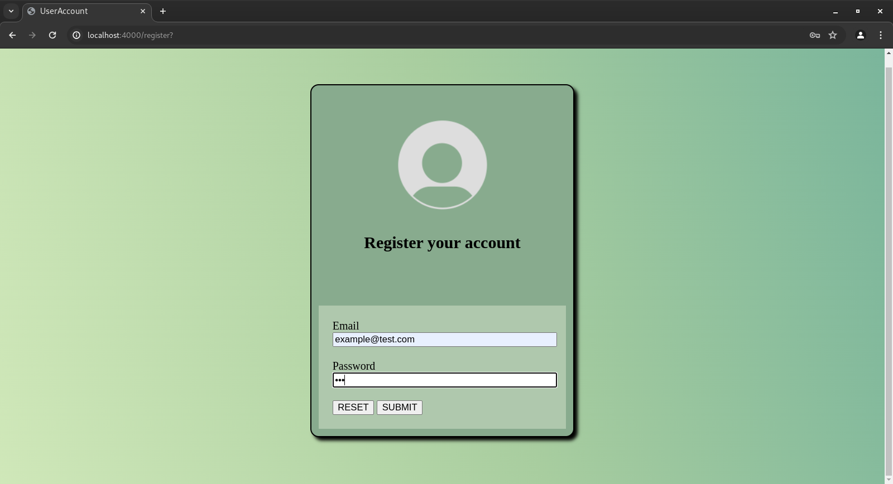

# User Account Implementation using Session-Based-Authentication
By default the session is saved on a database table `session` with expiration time 30 minutes. Hence, the user will still be logged in even after server restarts.

## Requirements
> Node.js and PostgreSQL.

## Configuration
- Create `.env` on `./`.
- Fill Environment variables: `COOKIE_SECRET`, `DB_HOST`, `DB_USER`, `DB_DATABASE`, `DB_PASS` and `DB_PORT`. 

## Run
```bash
    npm i
    npm start
```

## Result
> The server should be running at localhost:3000.

<div style="display: flex; justify-content:center; gap: 20px; ">



</div>

